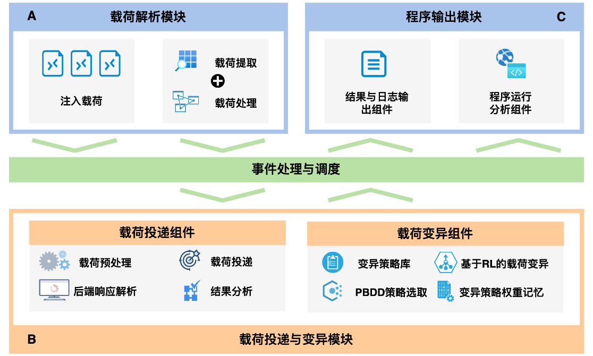

<div align="center">
  
  <h1 align="center">WAF Prowler</h1>
  <h3 align="center">基于协议层的WAF脆弱性检测</h3>
</div>

<!-- PROJECT SHIELDS -->

<p align="center">
  <a href="https://github.com/Cytmo/waf-prowler/graphs/contributors">
    
  </a>
  <a href="https://github.com/Cytmo/waf-prowler/network/members">
    
  </a>
  <a href="https://github.com/Cytmo/waf-prowler/stargazers">
    
  </a>
  <a href="https://img.shields.io/github/issues/Cytmo/waf-prowler.svg">
    
  </a>
</p>

<p align="center">
  <br />
  <a href="https://github.com/Cytmo/waf-prowler"><strong>探索本项目的文档 »</strong></a>
  <br />
  <br />
  <a href="https://github.com/Cytmo/waf-prowler/issues">报告Bug</a>
  ·
  <a href="https://github.com/Cytmo/waf-prowler/issues">提出新特性</a>
</p>

WAF-Prowler 是作为一个开箱即用的 Web 恶意载荷变异工具，可用于评测网络防火墙抵御未知攻击的能力，本项目的功能特性为：

1. 针对传统绕过技术因高度特定化而导致的通用性不足问题，本项目采用了基于协议层的 WAF 绕过机制。这种机制的核心是在不改动攻击载荷关键数据的前提下，通过修改协议层的内容来实现绕过 WAF 的目的，从而大大增强了方法的通用性；
2. 鉴于传统 WAF 绕过工具多依赖于穷举测试，导致效率低下，本项目引入了强化学习技术。该技术将载荷的变异方法视为动作空间的一部分，并将从 WAF 接收到的 HTTP 响应作为反馈信号，以此来指导更高效、更精准的载荷变异过程，从而实现 WAF 的有效绕过；
3. 为了解决如何高效选取和组合变异策略的问题，我们开发了一种基于权重的 Delta-Debugging 算法，能够较为准确地给出最有可能成功绕过 WAF 的变异策略及其组合。此外，针对实践中可能出现的相似载荷重复变异问题，本项目还引入了基于记忆的策略权重调整机制，利用先前运行结果来动态调整不同变异策略的权重，进而提高后续变异策略选择的精确度。

## 目录

- [上手指南](#上手指南)
  - [环境准备](#环境准备)
  - [运行参数](#运行参数)
  - [启动测试环境](#启动测试环境)
  - [运行测试程序](#运行测试程序)
  - [目录结构](目录结构)
- [工具介绍](#工具介绍)
  - [整体框架](#整体框架)
  - [变异方法](#变异方法)

## 上手指南

### 下载项目

```bash
git clone https://github.com/Cytmo/waf-prowler.git
```

### 环境准备

```bash
pip install -r requirements.txt
```

### 运行参数

`-m` enable mutants

### 启动测试环境

Use `set_test_env.sh` to set up the test environments

### 运行测试程序

Use `run.sh` to run the tests or run the following command:
`python3 main.py -m` to run the tests with mutants and memory
`python3 main.py -m --disable-memory` to run the tests with mutants and without memory
`python3 main.py --disable-memory -ds` to run the tests without memory and shortcut disabled

## 目录结构

```
.
├── Mutation-Methods.md
├── README.md
├── bash.sh
├── clean.sh
├── config
│   ├── log_config.ini
│   ├── memory.json
│   ├── payload
│   └── payload1
├── json_parse.py
├── main.py
├── profile.stats
├── requirements.txt
├── result
├── run.sh                        # 运行脚本
├── set_test_env.sh
├── test
│   ├── PHP5
│   ├── gowaf_modified
│   ├── gowaf_modified.go
│   ├── log
│   ├── run_modified_waf.sh
│   ├── test.go1
│   ├── test.py
│   └── test_payloads
├── test-envs
│   └── a-simple-waf
├── test.py
└── utils
    ├── dictUtils.py
    ├── log
    ├── logUtils.py
    ├── prowler_feature_extract.py
    ├── prowler_mutant.py
    ├── prowler_mutant_methods.py       # 变异方法具体实现
    ├── prowler_parse_raw_payload.py
    ├── prowler_process_requests.py
    ├── prowler_rl copy.py
    ├── prowler_rl.py
    ├── prowler_rl_based_mutant.py
    ├── prowler_send_request.py
    └── recordResUtils.py
```

## 工具介绍

### 整体框架

WAF 绕过载荷变异工具的系统架构图，主要由以下三个模块构成：
• 载荷解析模块：主要负责提取和处理输入的载荷。
• 载荷投递与变异模块：主要负责将解析后的载荷发往目标地址，并对无法绕过 WAF 的恶意载荷进行变异，以实现绕过。
• 程序输出模块：主要负责对结果进行分析、展示并记录日志。


### 变异方法

|        **绕过类型**         | **方法**                                                  |
| :-------------------------: | --------------------------------------------------------- |
| **基于属性修改的绕过**<br/> | 添加额外的 `Content-Type` 字段                            |
|                             | 伪造 `Content-Type` 字段                                  |
|                             | 修改 `multipart/form-data` 的 `boundary`                  |
|                             | 双写 `upload` 请求中的文件名                              |
|                             | 为 `GET` 请求添加 `Content-Type` 请求头                   |
|                             | 为 `GET` 请求的 URL 添加无害干扰命令                      |
|                             | 使用 `multipart` 文件传输方法发送请求                     |
|                             | 请求标头欺骗                                              |
|                             | 删除 `data` 中的 `Content-Type` 字段                      |
|                             | 修改 `Content-Type` 中的 `charset` 属性为 `ibm037` 等编码 |
|                             | 设置 `Accept-Charset` 属性为 `utf-32` 等字符集变体        |
|   **基于编码混淆的绕过**    | 修改 `headers` 大小写                                     |
|                             | 对 `URL` 进行编码                                         |
|                             | 对载荷进行 `Unicode` 编码                                 |
|                             | 对载荷进行 `HTML` 编码                                    |
|                             | 对载荷进行双重编码                                        |
|                             | 修改载荷的大小写                                          |
|                             | 修改 `Content-Type` 的大小写                              |
|                             | 修改 `Content-Type` 中属性名的大小写                      |
|                             | 修改 `PHP` 文件名                                         |
|   **基于参数污染的绕过**    | 在载荷中同时添加多个相同参数                              |
|    **利用畸形请求绕过**     | 在载荷中添加换行                                          |
|                             | 在载荷中添加空格                                          |
|                             | 在载荷中添加垃圾数据                                      |
|                             | 在载荷中添加制表符                                        |
|   **基于请求类型的绕过**    | 更改请求的类型                                            |
|   **基于分块传输的绕过**    | 使用分块方法发送请求                                      |
|     **基于资源的绕过**      | 在载荷中添加大量数据                                      |
